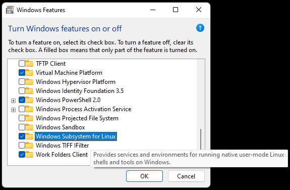
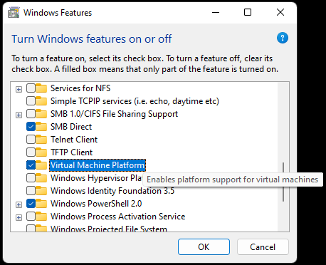

# Activated Windows and Office as a Precious Gift

## Install Windows

See my Windows installation guide at https://github.com/kyberdrb/Windows_tutorials/blob/master/windows_installation_post_installation_and_optimization_guides/WINDOWS_INSTALL_AND_POST_INSTALL_GUIDE.txt

Immediately after installation I recommend you to go back to this guide and activate Windows and Office, to enjoy fully functional operating system and software.

## Install KMS server to a machine in Windows Subsystem for Linux - WSL/WSL2 (PREFERRED for Windows 10 and newer)

1. Turn on WSL. Go to `Turn Windows features on or off` and check feature `Windows Subsystem for Linux`

    - `Windows Subsystem for Linux` feature is needed to start WSL machines.
    
        
    
    - `Virtual Machine Platform` is needed to enable WSL2.

       
    
    After installation, reboot the computer.

1. Install WSL2 update mentioned in https://docs.microsoft.com/en-us/windows/wsl/install-manual#step-4---download-the-linux-kernel-update-package

        Link: https://wslstorestorage.blob.core.windows.net/wslblob/wsl_update_x64.msi
    
1. Set WSL 2 as your default version. Open PowerShell and run this command to set WSL 2 as the default version when installing a next Linux distributions

        wsl --set-default-version 2
        
    The WSL2 is enabled when you see a message
    
        For information on key differences with WSL 2 please visit https://aka.ms/wsl2
        The operation completed successfully.
        
    If you get an error message saying
    
        Please enable the Virtual Machine Platform Windows feature and ensure virtualization is enabled in the BIOS.
For information please visit https://aka.ms/wsl2-install

    go back to the previous step about installing Windows features and repeat this step.

1. Reset network interfaces. Go to `Settings > Network & internet > Advanced network settings` and click on `Network reset`. If you have any networks you forgot credentials to, make sure you backup all configuration for the (wireless) network adapter. After the reset the Windows needs a restart.
1. Reboot
1. Install Alpine Linux from Microsoft Store: https://apps.microsoft.com/store/detail/alpine-wsl/9P804CRF0395?hl=de-at&gl=at
1. Open the Alpine Linux app. Let the Alpine Linux WSL machine initialize. Have patience, go do some other things, this will take some time.
1. When the Alpine Linux WSL machine is ready, download, build and run KMS server (permissions of a regular user are sufficient)

        su -
        apk update
        apk upgrade
        apk add --no-cache git make build-base
        exit
        cd "${HOME}"
        git clone --branch master --single-branch https://github.com/Wind4/vlmcsd.git
        cd vlmcsd/
        make vlmcsd
        cd bin/
        
1. Start the KMS server by running the `vlmcsd` binary
        
        ./vlmcsd -d -R 180d -t 3 -e -v  &
        
    or to have a log file at hand
    
        ./vlmcsd -D -d -R 180d -t 3 -e -v | tee -a "${HOME}/vlmcsd-logged_with_tee.log" &
        # or
        ./vlmcsd -D -d -R 180d -t 3 -e -v -l "${HOME}/vlmcsd-logged_with_builtin_option.log" &

    Explanations of options:
    
        -D                    run in foreground
        ommit '-D' in order to run in background
        -d                    disconnect clients after each request
        -R <interval>         renew activation every <interval> (default 1w)
        -t <seconds>          disconnect clients after <seconds> of inactivity (default 30)
        -e                    log to stdout
        -v                    log verbose
        -l                    log to <file>
        
1. Allow ping messages to verify if the bidirectional communication is possible and Windows host and Alpine Linux WSL machine are mutually reachable

    Btw. pinging the WSL2 machine from Windows 11 gets the response.

    ping: `Windows 11 host ---> WSL2 machine` - succeeds  
    ping: `WSL2 machine    -X-> Windows 11 host` - fails

Find the IP address of the Windows host by running below command in PowerShell/Command Prompt:

        ipconfig /all

Go to the Alpine Linux WSL machine and run a continuous ping from the WSL machine to the IP address of the Windows host found in the previous step

        su -c "ping 192.168.0.15"
        
Allow ping echo and response messages in Windows Firewall by enabling firewall rules to ping Windows 11 host from WSL2 machine. Go to `Settings > Privacy & security > Firewall & network protection > Advanced settings > Inbound rules`. Sort the services by `Name` column for faster navigation. It's sufficient to enable the rule with the name `Core Networking Diagnostics - ICMP Echo Request (ICMPv4-In)` for `Private, Public` profiles by right-clicking on the rule and clicking on `Enable Rule`. For complete setup, enable also the rule with the same name for the `Domain` profile. As soon as you enable the ICMP rule, the ping from the WSL machine starts to show connectivity immediately.

Sources:

- https://phoenixnap.com/kb/how-to-find-ip-address-linux
- https://duckduckgo.com/?q=wsl+root+user+switch+alpine&ia=web
- https://www.tenforums.com/tutorials/128156-switch-user-windows-subsystem-linux-wsl-distro-windows-10-a.html
- https://www.bing.com/search?q=ping+windows+from+wsl&cvid=b79fb48b178e42c1a816b9e6303144b5&aqs=edge.0.0l5.6078j0j4&FORM=ANAB01&PC=U531
- https://superuser.com/questions/1358297/windows-10-wsl-ubuntu-unable-to-ping-anything
- https://github.com/Microsoft/WSL/issues/475
- https://duckduckgo.com/?q=ping+windows+from+wsl&ia=web
- WSL2 unable to ping host machine: https://github.com/microsoft/WSL/issues/4171
- Reset settings for all network adapters - Fixes out-of-range IP addresses for WSL machines: https://github.com/microsoft/WSL/issues/4171#issuecomment-511421498
- Windows Firewall rules to enable bidirectional pings between WSL2 and host to verify mutual connection: https://github.com/microsoft/WSL/issues/4171#issuecomment-559961027
- https://duckduckgo.com/?q=ping+host+from+wsl&ia=web
- Access Windows host from WSL 2: https://gist.github.com/vilic/0edcb3bec10339a3b633bc9305faa8b5
- https://duckduckgo.com/?q=bridge+wsl2+vethernet+with+wifi+adapter&ia=web
- https://docs.microsoft.com/en-us/answers/questions/216604/can-i-create-a-bridged-network-for-wsl2.html
- https://docs.microsoft.com/en-us/windows/wsl/networking
- https://superuser.com/questions/1358297/windows-10-wsl-ubuntu-unable-to-ping-anything
- https://docs.microsoft.com/en-US/troubleshoot/windows-server/networking/netsh-advfirewall-firewall-control-firewall-behavior
- Windows WSL 2 can't ping host machine (2 Solutions!!): https://www.youtube.com/watch?v=fQJcQT5cbx0
- 

1. Verify the KMS server is running

        netstat -plantu

        netstat: showing only processes with your user ID
        Active Internet connections (servers and established)
        Proto Recv-Q Send-Q Local Address           Foreign Address         State       PID/Program name
        tcp        0      0 0.0.0.0:1688            0.0.0.0:*               LISTEN      423/vlmcsd
        tcp        0      0 :::1688                 :::*                    LISTEN      423/vlmcsd

    ---

        su -c "netstat -plantu"

        Password:
        Active Internet connections (servers and established)
        Proto Recv-Q Send-Q Local Address           Foreign Address         State       PID/Program name
        tcp        0      0 0.0.0.0:1688            0.0.0.0:*               LISTEN      423/vlmcsd
        tcp        0      0 :::1688                 :::*                    LISTEN      423/vlmcsd

    ---
    
        ps

        PID   USER     TIME  COMMAND
            1 root      0:00 /init
            6 root      0:00 /init
            7 root      0:00 /init
            8 machine   0:00 -ash
          445 machine   0:00 ./vlmcsd -d -R 180d -t 3 -e -v
          446 machine   0:00 ps
          
Sources:

- https://github.com/Wind4/vlmcsd
- https://github.com/Wind4/vlmcsd/blob/master/man/vlmcsd.8

## Configure Windows Firewall

1. Open `Windows Firewall` either with pressing `Win+R` and typing

        firewall.cpl
        
    [`Ctrl + Shift + Enter` to run with elevated priviledges]
  
    or via searching for `firewall` and clicking on `Windows Firewall` app and then in the panel on the left-hand side click on `Advanced settings`. Enter administrator's password when prompted.
    
    or - in Windows 11 - via `Control panel` (View by: Large icons) `->` `Windows Firewall` or `Windows Defender Firewall` and then in the left panel click on `Advanced settings`
    
    or, in Windows 11, via opening the _Start_ menu, searching for `firewall` and opening `Firewall & network protection` and then at the botton clicking on `Advanced settings`

1. In the left panel click on `Inbound Rules`
  1. For convenience and easier and faster navigation, sort the rules by name by clicking at the `Name` column.
  1. Search for rules named `Key Management Service (TCP-In)`. In my case I have one rule for `Private, Public` networks and one for `Domain` network.
  1. Make sure that at least the `Key Management Service (TCP-In)` rule is enabled for the `Public, Private` profile, because for bidirectional KMS communication and successful local activation is **sufficient** only to enable the `Key Management Service (TCP-In)` Inbound rule for `Public, Private` profile is enabled [marked with a white checkmark in a green circle].
  
      To enable these rules, right click on the rule and from the context menu click on `Enable Rule`
      
      
      
1. While the KMS server in WSL2 machine is running, test that KMS communication passes through. Open PowerShell and test that TCP port 1688 is open
    
        Test-NetConnection -ComputerName 192.168.56.101 -Port 1688
        
    Output when communication channels are open
    
        ComputerName     : 172.29.207.20
        RemoteAddress    : 172.29.207.20
        RemotePort       : 1688
        InterfaceAlias   : vEthernet (WSL)
        SourceAddress    : 172.29.192.1
        TcpTestSucceeded : True
      
1. [SKIP THIS STEP! UNNECESSARY! but left for reference]

    In the left panel click on `Outbound Rules`
    
    1. For convenience sort the rules by name by clicking at the `Name` column.
    1. Search for rules named `Key Management Service (TCP-In)`. In my case I didn't have any rule with this name or any outbound rule associated with a remote TCP port 1688, so we create one, in order to send activation requests to our local KMS server in a Docker container (maybe in a virtualized Alpine Linux system in VirtualBox or in WSL environment)
    1. In the panel on the right-hand side, click at the `New rule` entry (at the top). A dialog `New Outbound Rule Wizard` pops up.
        1. Select `Port`. Click on `Next`
        1. Select `TCP`  
          In the text field next to `Specific remote ports` enter number `1688` which is the port of KMS communication.
        1. Select `Allow the connection`
        1. Check all three ranges `Domain`, `Private` and `Public`.
        1. Enter name: `Key Management Service (TCP-out)`  
          Enter decription: `Key Management Service`
        1. Click on `Finish` button. The rule is now active and added to the list of rules.

        

        

1. While the KMS server in WSL2 machine is running, test that KMS communication passes through. Open PowerShell and test that TCP port 1688 is open
    
        Test-NetConnection -ComputerName 192.168.56.101 -Port 1688
        
    (according to https://sid-500.com/2018/02/02/powershell-test-open-tcp-ports-with-test-openport-multiple-hosts-multiple-port-numbers/)
    
    When the KMS port 1688 is open and the communication passes through, you might see similar output like this

        ComputerName           : 192.168.56.101
        RemoteAddress          : 192.168.56.101
        RemotePort             : 1688
        InterfaceAlias         : VirtualBox Host-Only Network
        SourceAddress          : 192.168.56.1
        PingSucceeded          : True
        PingReplyDetails (RTT) : 0 ms
        TcpTestSucceeded       : True
        
    Example output on Windows 11 host when testing KMS communication with KMS server in Alpine Linux as WSL2 machine

        PS C:\Users\machine> Test-NetConnection -ComputerName 172.26.175.118 -Port 1688

        ComputerName     : 172.26.175.118
        RemoteAddress    : 172.26.175.118
        RemotePort       : 1688
        InterfaceAlias   : vEthernet (WSL)
        SourceAddress    : 172.26.160.1
        TcpTestSucceeded : True

    The entry `TcpTestSucceeded : True` indicates that the local KMS port for incoming and outgoing KMS communication are open and the remote port on the KMS server in the Docker container is also open in both directions and available to receive activation requests.
    
    When the test fails - the VirtualBox Alpine Linux virtual machine, Docker KMS server container is not running, the firewall in Windows or Linux blocks the connection or the virtual machine's network adapter is not set up for `Promiscuous mode` for `Host-only` attached network adapter or the `Port-Forwarding` is not set up for `NAT` attached network adapter, it may looks like this:
    
        WARNING: Ping to 192.168.56.101 failed -- Status: DestinationHostUnreachable
        WARNING: TCP connect to 192.168.56.101:1688 failed

        ComputerName           : 192.168.56.101
        RemoteAddress          : 192.168.56.101
        RemotePort             : 1688
        InterfaceAlias         : WiFi
        SourceAddress          : 192.168.0.15
        PingSucceeded          : False
        PingReplyDetails (RTT) : 0 ms
        TcpTestSucceeded       : False
    
I assume the KMS communication passes through.  
Let's go activate some things...

## Install Microsoft Office

Make sure the Microsoft Office suite is in `Volume License` (`VL`) or in `LTSC (for Office 2021)` version, otherwise the KMS activation might not work. [TODO test whether it's really true for retail versions of MS Office]

- For Windows 10 and newer: Office 2019/LTSC 2021 - Office Deployment Tool

1. Download `Office Deployment Tool` from https://www.microsoft.com/en-us/download/details.aspx?id=49117

    Downloading `Microsoft Office LTSC 2021 Volume License Pack` is not necessary. The Office Deployment Tool is sufficient.

1. Open the downloaded Deployment Tool and let it extract to a separate directory with name `Office_Deployment_Tool` in the Downloads directory.

1. After extraction has finished, go to the directory with extracted files.

1. Go to the page for `Office Customization Tool`: https://config.office.com/deploymentsettings

1. Import the configuration with name `configuration-Office2021Enterprise.xml`

1. Edit the parameters for the Office installation: which apps will be installed. In part `Licensing and activation` select `KMS` and enable `Accept EULA` for fluent unattended installation. After completing the configuration, go to the right hand side if the page and click on `Export`. Save it under the name `configuration-Office2021ProPlusLTSC-en-us.xml`

    Content of `configuration-Office2021ProPlusLTSC-en-us.xml`

        <Configuration ID="2bbb27dd-fea6-4de5-918c-8468a67d9694">
          <Add OfficeClientEdition="64" Channel="PerpetualVL2021">
            <Product ID="ProPlus2021Volume" PIDKEY="FXYTK-NJJ8C-GB6DW-3DYQT-6F7TH">
              <Language ID="en-us" />
              <ExcludeApp ID="Access" />
              <ExcludeApp ID="Lync" />
              <ExcludeApp ID="OneDrive" />
              <ExcludeApp ID="OneNote" />
              <ExcludeApp ID="Outlook" />
              <ExcludeApp ID="Publisher" />
              <ExcludeApp ID="Teams" />
            </Product>
          </Add>
          <Property Name="SharedComputerLicensing" Value="0" />
          <Property Name="FORCEAPPSHUTDOWN" Value="FALSE" />
          <Property Name="DeviceBasedLicensing" Value="0" />
          <Property Name="SCLCacheOverride" Value="0" />
          <Property Name="AUTOACTIVATE" Value="1" />
          <Updates Enabled="TRUE" />
          <AppSettings>
            <User Key="software\microsoft\office\16.0\excel\options" Name="defaultformat" Value="60" Type="REG_DWORD" App="excel16" Id="L_SaveExcelfilesas" />
            <User Key="software\microsoft\office\16.0\powerpoint\options" Name="defaultformat" Value="52" Type="REG_DWORD" App="ppt16" Id="L_SavePowerPointfilesas" />
            <User Key="software\microsoft\office\16.0\word\options" Name="defaultformat" Value="ODT" Type="REG_SZ" App="word16" Id="L_SaveWordfilesas" />
          </AppSettings>
          <Display Level="Full" AcceptEULA="TRUE" />
        </Configuration>

    For Slovak version, use file `configuration-Office2021ProPlusLTSC-sk-sk.xml`  
    or change the `Language ID` tag to `<Language ID="sk-sk" />`

    - The latest version of MS Office for Windows 8 and 8.1 is `MS Office 2016 VL`
        - Multiple Office 2016 Volume License (VL) language versions - https://gist.github.com/ernisn/f71ad6e16d7a2ede076eb41c67489d17
          - search for `Office 2016 Pro Plus VL VLSC Edition ISO Links.txt`
          - I downloaded only file  
          `SW_DVD5_Office_Professional_Plus_2016_64Bit_Slovak_MLF_X20-42455.ISO    961 MB`
          - preferred option
          - original magnet link  
          magnet:?xt=urn:btih:867a355860203cbf0ea26888582426de10838f32
          - magnet link copied from Transmission after opening and downloading ISO  
          magnet:?xt=urn:btih:867a355860203cbf0ea26888582426de10838f32&dn=%D0%9E%D1%80%D0%B8%D0%B3%D0%B8%D0%BD%D0%B0%D0%BB%D1%8C%D0%BD%D1%8B%D0%B5%20Microsoft%20Office%202016%20Professional%20Plus%20VL%2016.0.4266.1001%20%28x86x64%29%20MULTI40
          - uncheck all files (language versions) that you don't want to download in the torrent's properties (in my case `Transmission`), otherwise it will download nearly 80 GB of data!
        - MS Office 2016 Pro Plus VL X64 en-US SEP 2018 - https://pirate-proxy.me/description.php?id=24756892
          - magnet:?xt=urn:btih:a637f9c38dc102e134b803353be3c7ea1ab6e83d&dn=MS%20Office%202016%20Pro%20Plus%20VL%20X64%20en-US%20SEP%202018%20%7BGen2%7D&tr=udp%3A%2F%2Ftracker.coppersurfer.tk%3A6969%2Fannounce&tr=udp%3A%2F%2Ftracker.openbittorrent.com%3A6969%2Fannounce&tr=udp%3A%2F%2F9.rarbg.to%3A2710%2Fannounce&tr=udp%3A%2F%2F9.rarbg.me%3A2780%2Fannounce&tr=udp%3A%2F%2F9.rarbg.to%3A2730%2Fannounce&tr=udp%3A%2F%2Ftracker.opentrackr.org%3A1337&tr=http%3A%2F%2Fp4p.arenabg.com%3A1337%2Fannounce&tr=udp%3A%2F%2Ftracker.torrent.eu.org%3A451%2Fannounce&tr=udp%3A%2F%2Ftracker.tiny-vps.com%3A6969%2Fannounce&tr=udp%3A%2F%2Fopen.stealth.si%3A80%2Fannounce

1. Open PowerShell or Command Prompt **with elevated permissions** and execute commands to install :

        cd C:\Users\machine\Downloads\Office_Deployment_Tool

        .\setup.exe /configure configuration-Office2021ProPlusLTSC-en-us.xml

        .\setup.exe /configure configuration-Office2021ProPlusLTSC-en-us.xml

        cd "C:\Program Files\Microsoft Office\Office16"
        
    or a single multi-command
    
        cd C:\Users\machine\Downloads\Office_Deployment_Tool; `
        .\setup.exe /configure configuration-Office2021ProPlusLTSC-en-us.xml; `
        .\setup.exe /configure configuration-Office2021ProPlusLTSC-en-us.xml; `
        cd "C:\Program Files\Microsoft Office\Office16"

Sources:

- https://docs.microsoft.com/en-us/deployoffice/ltsc2021/deploy
- https://duckduckgo.com/?q=office+deployment+tool+The+Setup+command+may+only+be+used+inside+a+Describe+block.&t=h_&ia=web
- Failed to download Office 2019 installation file: https://github.com/MicrosoftDocs/OfficeDocs-DeployOffice/issues/187 - `The Setup command may only be used inside a Describe block.`
- https://github.com/MicrosoftDocs/OfficeDocs-DeployOffice/issues/187#issuecomment-796147882 - PREFERRED SOLUTION
- https://github.com/MicrosoftDocs/OfficeDocs-DeployOffice/issues/187#issuecomment-438765237 - ALTERNATIVE SOLUTION

On Alpine Linux as WSL2 machine:

Go to the Alpine Linux in WSL and start the KMS server

        /home/machine/vlmcsd/bin/vlmcsd -D -d -R 180d -t 3 -e -v | tee -a "${HOME}/vlmcsd.log"

Go back to Windows 11 host:

1. Display license information for installed product keys.

        cscript ospp.vbs /dstatus

1. Remove KMS host name (sets port to default: `1688`).

        cscript ospp.vbs /remhst

1. Disable KMS host caching. The IP address of the KMS server changes, especially in WSL machines by default, just by re-opening the WSL app.

        cscript ospp.vbs /cachst:FALSE

1. Install a product key(replaces existing key) with user-provided product key. Value parameter applies. **This step is not necessary when you already in the `Office Customization Tool` chose the KMS license version for Office 2021 LTSC Professional Plus which enters a KMS key automatically.**

        cscript ospp.vbs /inpkey:FXYTK-NJJ8C-GB6DW-3DYQT-6F7TH

    More KMS keys - for reference - for Microsoft Office are available at

    - https://docs.microsoft.com/en-us/DeployOffice/vlactivation/gvlks
    - https://docs.microsoft.com/en-us/DeployOffice/vlactivation/gvlks#gvlks-for-office-ltsc-2021

1. Set a KMS host namewith user-provided host name. Assuming that KMS port is set default value `1688`

        cscript ospp.vbs /sethst:172.22.207.227
        
    You can optionally set the Office activator to send activation requests to different port when the KMS Server listens at different port than the default TCP `1688` with the command `cscript ospp.vbs /setprt:1688`

1. Activate installed Office product keys. 
    
        cscript ospp.vbs /act

1. Verify the activation status in terminal

        cscript ospp.vbs /dstatus

1. Verify the activation status in one of the applications of Microsoft Office, e.g. in Word, if you have that one installed.

    At the starting screen, or by clicking on `File` tab in the ribbon, and click on `Account`. Under `Product Information` will be shown `Product activated`.

Sources:

- `ospp.htm`
- https://gist.github.com/jerodg/502bd80a715347662e79af526c98f187#office-kms-setup
- For more GVLK keys for Office suites see:
    - https://docs.microsoft.com/en-us/DeployOffice/vlactivation/gvlks
    - https://github.com/alvolalex/ms_office_gvlk
    - or better readable raw version: https://raw.githubusercontent.com/alvolalex/ms_office_gvlk/main/README.md

### Microsoft Office GVLK KMS Keys

        GVLK KEYS:

        2010:

        Office Professional Plus 2010
        VYBBJ-TRJPB-QFQRF-QFT4D-H3GVB

        Office Standard 2010
        V7QKV-4XVVR-XYV4D-F7DFM-8R6BM

        Office Home and Business 2010
        D6QFG-VBYP2-XQHM7-J97RH-VVRCK

        Project Professional 2010
        YGX6F-PGV49-PGW3J-9BTGG-VHKC6

        Project Standard 2010
        4HP3K-88W3F-W2K3D-6677X-F9PGB

        Visio Premium 2010
        D9DWC-HPYVV-JGF4P-BTWQB-WX8BJ

        Visio Professional 2010
        7MCW8-VRQVK-G677T-PDJCM-Q8TCP

        Visio Standard 2010
        767HD-QGMWX-8QTDB-9G3R2-KHFGJ

        Access 2010
        V7Y44-9T38C-R2VJK-666HK-T7DDX

        Excel 2010
        H62QG-HXVKF-PP4HP-66KMR-CW9BM

        InfoPath 2010
        K96W8-67RPQ-62T9Y-J8FQJ-BT37T

        OneNote 2010
        Q4Y4M-RHWJM-PY37F-MTKWH-D3XHX

        Outlook 2010
        7YDC2-CWM8M-RRTJC-8MDVC-X3DWQ

        PowerPoint 2010
        RC8FX-88JRY-3PF7C-X8P67-P4VTT

        Publisher 2010
        BFK7F-9MYHM-V68C7-DRQ66-83YTP

        SharePoint Workspace 2010
        QYYW6-QP4CB-MBV6G-HYMCJ-4T3J4

        Word 2010
        HVHB3-C6FV7-KQX9W-YQG79-CRY7T

        +++++++++++++++++++++++++++++++++++++++++++++++++++++++++++++++++++++++++++++++++++++++++

        2013:

        Office 2013 Professional Plus
        YC7DK-G2NP3-2QQC3-J6H88-GVGXT

        Office 2013 Standard
        KBKQT-2NMXY-JJWGP-M62JB-92CD4

        Project 2013 Professional
        FN8TT-7WMH6-2D4X9-M337T-2342K

        Project 2013 Standard
        6NTH3-CW976-3G3Y2-JK3TX-8QHTT

        Visio 2013 Professional
        C2FG9-N6J68-H8BTJ-BW3QX-RM3B3

        Visio 2013 Standard
        J484Y-4NKBF-W2HMG-DBMJC-PGWR7

        Access 2013
        NG2JY-H4JBT-HQXYP-78QH9-4JM2D

        Excel 2013
        VGPNG-Y7HQW-9RHP7-TKPV3-BG7GB

        InfoPath 2013
        DKT8B-N7VXH-D963P-Q4PHY-F8894

        Lync 2013
        2MG3G-3BNTT-3MFW9-KDQW3-TCK7R

        OneNote 2013
        TGN6P-8MMBC-37P2F-XHXXK-P34VW

        Outlook 2013
        QPN8Q-BJBTJ-334K3-93TGY-2PMBT

        PowerPoint 2013
        4NT99-8RJFH-Q2VDH-KYG2C-4RD4F

        Publisher 2013
        PN2WF-29XG2-T9HJ7-JQPJR-FCXK4

        Word 2013
        6Q7VD-NX8JD-WJ2VH-88V73-4GBJ7

        +++++++++++++++++++++++++++++++++++++++++++++++++++++++++++++++++++++++++++++++++++++++++

        2016:

        Office Professional Plus 2016 GVLK
        XQNVK-8JYDB-WJ9W3-YJ8YR-WFG99

        Office Standard 2016 GVLK
        JNRGM-WHDWX-FJJG3-K47QV-DRTFM

        Project Professional 2016 GVLK
        YG9NW-3K39V-2T3HJ-93F3Q-G83KT

        Project Standard 2016 GVLK
        GNFHQ-F6YQM-KQDGJ-327XX-KQBVC

        Visio Professional 2016 GVLK
        PD3PC-RHNGV-FXJ29-8JK7D-RJRJK

        Visio Standard 2016 GVLK
        7WHWN-4T7MP-G96JF-G33KR-W8GF4

        Access 2016 GVLK
        GNH9Y-D2J4T-FJHGG-QRVH7-QPFDW

        Excel 2016 GVLK
        9C2PK-NWTVB-JMPW8-BFT28-7FTBF

        OneNote 2016 GVLK
        DR92N-9HTF2-97XKM-XW2WJ-XW3J6

        Outlook 2016 GVLK
        R69KK-NTPKF-7M3Q4-QYBHW-6MT9B

        Powerpoint 2016 GVLK
        J7MQP-HNJ4Y-WJ7YM-PFYGF-BY6C6

        Publisher 2016 GVLK
        F47MM-N3XJP-TQXJ9-BP99D-8K837

        Skype 2016 GVLK
        869NQ-FJ69K-466HW-QYCP2-DDBV6

        Word 2016 GVLK
        WXY84-JN2Q9-RBCCQ-3Q3J3-3PFJ6

        +++++++++++++++++++++++++++++++++++++++++++++++++++++++++++++++++++++++++++++++++++++++++

        2019:

        Office Professional Plus 2019
        NMMKJ-6RK4F-KMJVX-8D9MJ-6MWKP

        Office Standard 2019
        6NWWJ-YQWMR-QKGCB-6TMB3-9D9HK

        Project Professional 2019
        B4NPR-3FKK7-T2MBV-FRQ4W-PKD2B

        Project Standard 2019
        C4F7P-NCP8C-6CQPT-MQHV9-JXD2M

        Visio Professional 2019
        9BGNQ-K37YR-RQHF2-38RQ3-7VCBB

        Visio Standard 2019
        7TQNQ-K3YQQ-3PFH7-CCPPM-X4VQ2

        Access 2019
        9N9PT-27V4Y-VJ2PD-YXFMF-YTFQT

        Excel 2019
        TMJWT-YYNMB-3BKTF-644FC-RVXBD

        Outlook 2019
        7HD7K-N4PVK-BHBCQ-YWQRW-XW4VK

        PowerPoint 2019
        RRNCX-C64HY-W2MM7-MCH9G-TJHMQ

        Publisher 2019
        G2KWX-3NW6P-PY93R-JXK2T-C9Y9V

        Skype for Business 2019
        NCJ33-JHBBY-HTK98-MYCV8-HMKHJ

        Word 2019
        PBX3G-NWMT6-Q7XBW-PYJGG-WXD33

        +++++++++++++++++++++++++++++++++++++++++++++++++++++++++++++++++++++++++++++++++++++++++

        LTSC 2021:

        Office LTSC Professional Plus 2021
        FXYTK-NJJ8C-GB6DW-3DYQT-6F7TH

        Office LTSC Standard 2021
        KDX7X-BNVR8-TXXGX-4Q7Y8-78VT3

        Project Professional 2021
        FTNWT-C6WBT-8HMGF-K9PRX-QV9H8

        Project Standard 2021
        J2JDC-NJCYY-9RGQ4-YXWMH-T3D4T

        Visio LTSC Professional 2021
        KNH8D-FGHT4-T8RK3-CTDYJ-K2HT4

        Visio LTSC Standard 2021
        MJVNY-BYWPY-CWV6J-2RKRT-4M8QG

        Access LTSC 2021
        WM8YG-YNGDD-4JHDC-PG3F4-FC4T4

        Excel LTSC 2021
        NWG3X-87C9K-TC7YY-BC2G7-G6RVC

        Outlook LTSC 2021
        C9FM6-3N72F-HFJXB-TM3V9-T86R9

        PowerPoint LTSC 2021
        TY7XF-NFRBR-KJ44C-G83KF-GX27K

        Publisher LTSC 2021
        2MW9D-N4BXM-9VBPG-Q7W6M-KFBGQ

        Skype for Business LTSC 2021
        HWCXN-K3WBT-WJBKY-R8BD9-XK29P

        Word LTSC 2021
        TN8H9-M34D3-Y64V9-TR72V-X79KV
        +++++++++++++++++++++++++++++++++++++++++++++++++++++++++++++++++++++++++++++++++++++++++

        https://raw.githubusercontent.com/alvolalex/ms_office_gvlk/main/README.md

        https://docs.microsoft.com/en-us/DeployOffice/vlactivation/gvlks?redirectedfrom=MSDN

## Activate Windows

Download Windows 11 from 

- the official site: https://www.microsoft.com/software-download/windows11
- `Windows ISO Downloader` / `Microsoft Windows and Office ISO Download Tool` from HeiDoc.net: https://www.heidoc.net/joomla/technology-science/microsoft/67-microsoft-windows-iso-download-tool
    - ./kyberdrb/Ing_Projekt-Virtualne_sietove_laboratoria/dalsie_materialy/Windows ISO Downloader 5.2.9.0/Windows ISO Downloader.exe
    - ./kyberdrb/Ing_Projekt-Virtualne_sietove_laboratoria/eve_ng/07_9_vytvorenie_windows_10_kvm_virtualky_s_virtio_ovladacmi-CIASTOCNY_USPECH.txt
    - ./kyberdrb/Ing_Projekt-Virtualne_sietove_laboratoria/eve_ng/05_1_adresarova_struktura_uzitocne_eve-ng_subory.txt
        - line 631
- torrent / file sharing sites

Open Command Prompt or PowerShell as Administrator and execute these commands (use `slmgr.vbs /?` or `slmgr.vbs /help` to show explanation of the options) [TODO scriptify this for easier, automated reactivation when prompted by Windows about not activated state]:

1. Clear current cached KMS host
        
        slmgr.vbs /ckms

1. Disable KMS host caching

        slmgr.vbs /ckhc

1. Flush local system DNS cache (doesn't work on Windows 11)

        slmgr.vbs /flushdns

1. Uninstall current product key

        slmgr.vbs /upk

1. Clear current product key from the registry.  
    If you'd like to backup the current Windows product key, do it now with either with commands `` or with external utility like `Magical Jellybean`, which will display the current product key installed in Windows.

        slmgr.vbs /cpky

    When you clear the key from the registry after successful activation, the Windows remains still activated, but the product key will be harder to recover, because classical Command Prompt/PowerShell commands for Windows product key retrieval will give empty output.

1. Install new (GVLK) product key

    For Windows 8.1 Pro

        slmgr.vbs /ipk HMCNV-VVBFX-7HMBH-CTY9B-B4FXY
        
    For Windows 11 Pro
    
        slmgr.vbs /ipk W269N-WFGWX-YVC9B-4J6C9-T83GX

1. Configure the IP address of the KMS server. You can show the IPv4 adress in Alpine Linux with command `ip route`

        default via 172.22.192.1 dev eth0
        172.22.192.0/20 dev eth0 scope link  src 172.22.207.227

    or with `ip addr show dev eth0`
    
        6: eth0: <BROADCAST,MULTICAST,UP,LOWER_UP> mtu 1500 qdisc mq state UP qlen 1000
            link/ether 00:15:5d:69:c3:b8 brd ff:ff:ff:ff:ff:ff
            inet 172.22.207.227/20 brd 172.22.207.255 scope global eth0
               valid_lft forever preferred_lft forever
            inet6 fe80::215:5dff:fe69:c3b8/64 scope link
               valid_lft forever preferred_lft forever

    For VirtualBox machine

        slmgr.vbs /skms 192.168.56.101
        
    For WSL/WSL2 machine (In Windows 11 the Alpine Linux machine gets a new IP address on each start)
    
        slmgr.vbs /skms 172.22.207.227

    Optionally you can specify the port too, when you want to set it explicitly or when the port the KMS server listens to differs from the default TCP port for KMS communication `1688` with the command `slmgr.vbs /skms <host_or_IP_address>:<port>`

1. Send activation request for Windows

        slmgr.vbs /ato

1. Show activation status for Windows (brief output)

        slmgr.vbs /dli

1. Show activation status for Windows (longer output)

        slmgr.vbs /dlv

1. Show activation status for Windows (complete output)

        slmgr.vbs /dli All
        slmgr.vbs /dlv All
        
(according to  
https://adsecurity.org/?p=301 - KMS Part 2  
and  
https://gist.github.com/jerodg/502bd80a715347662e79af526c98f187#configure-kms-client

Example of a log from KMS server in Alpine Linux in WSL during activation after `skms` command:

    2022-09-10 10:06:41: <<< Incoming KMS request
    2022-09-10 10:06:41: Protocol version                : 6.0
    2022-09-10 10:06:41: Client is a virtual machine     : No
    2022-09-10 10:06:41: Licensing status                : 5 (Notification)
    2022-09-10 10:06:41: Remaining time (0 = forever)    : 0 minutes
    2022-09-10 10:06:41: Application ID                  : 55c92734-d682-4d71-983e-d6ec3f16059f (Unknown)
    2022-09-10 10:06:41: SKU ID (aka Activation ID)      : 2de67392-b7a7-462a-b1ca-108dd189f588 (Unknown)
    2022-09-10 10:06:41: KMS ID (aka KMS counted ID)     : 58e2134f-8e11-4d17-9cb2-91069c151148 (Unknown)
    2022-09-10 10:06:41: Client machine ID               : 5de705b1-638b-4474-9984-19e0e81d928f
    2022-09-10 10:06:41: Previous client machine ID      : 00000000-0000-0000-0000-000000000000
    2022-09-10 10:06:41: Client request timestamp (UTC)  : 2022-09-10 10:06:36
    2022-09-10 10:06:41: Workstation name                : DESKTOP-E4TBM3L
    2022-09-10 10:06:41: N count policy (minimum clients): 25
    2022-09-10 10:06:41: Protocol version                : 6.0
    2022-09-10 10:06:41: KMS host extended PID           : 06401-00206-551-765577-03-2064-9600.0000-1762021
    2022-09-10 10:06:41: KMS host Hardware ID            : 3A1C049600B60076
    2022-09-10 10:06:41: Client machine ID               : 5de705b1-638b-4474-9984-19e0e81d928f
    2022-09-10 10:06:41: Client request timestamp (UTC)  : 2022-09-10 10:06:36
    2022-09-10 10:06:41: KMS host current active clients : 50
    2022-09-10 10:06:41: Renewal interval policy         : 259200
    2022-09-10 10:06:41: Activation interval policy      : 120
    2022-09-10 10:06:41: IPv4 connection closed: 172.26.160.1:51436.

### Windows KMS GVLK Keys

        Generic Volume License Keys (GVLK)
        In the tables that follow, you will find the GVLKs for each version and edition of Windows. LTSC is Long-Term Servicing Channel, while LTSB is Long-Term Servicing Branch.

        Windows Server (LTSC versions)
        Windows Server 2022
        WINDOWS SERVER 2022
        Operating system edition    KMS Client Product Key
        Windows Server 2022 Datacenter    WX4NM-KYWYW-QJJR4-XV3QB-6VM33
        Windows Server 2022 Standard    VDYBN-27WPP-V4HQT-9VMD4-VMK7H
        Windows Server 2019
        WINDOWS SERVER 2019
        Operating system edition    KMS Client Product Key
        Windows Server 2019 Datacenter    WMDGN-G9PQG-XVVXX-R3X43-63DFG
        Windows Server 2019 Standard    N69G4-B89J2-4G8F4-WWYCC-J464C
        Windows Server 2019 Essentials    WVDHN-86M7X-466P6-VHXV7-YY726
        Windows Server 2016
        WINDOWS SERVER 2016
        Operating system edition    KMS Client Product Key
        Windows Server 2016 Datacenter    CB7KF-BWN84-R7R2Y-793K2-8XDDG
        Windows Server 2016 Standard    WC2BQ-8NRM3-FDDYY-2BFGV-KHKQY
        Windows Server 2016 Essentials    JCKRF-N37P4-C2D82-9YXRT-4M63B
        Windows Server (Semi-Annual Channel versions)
        Windows Server, versions 20H2, 2004, 1909, 1903, and 1809
        WINDOWS SERVER, VERSIONS 20H2, 2004, 1909, 1903, AND 1809
        Operating system edition    KMS Client Product Key
        Windows Server Datacenter    6NMRW-2C8FM-D24W7-TQWMY-CWH2D
        Windows Server Standard    N2KJX-J94YW-TQVFB-DG9YT-724CC
        Windows 11 and Windows 10 (Semi-Annual Channel versions)
        See the Windows lifecycle fact sheet for information about supported versions and end of service dates.

        WINDOWS 11 AND WINDOWS 10 (SEMI-ANNUAL CHANNEL VERSIONS)
        Operating system edition    KMS Client Product Key
        Windows 11 Pro
        Windows 10 Pro    W269N-WFGWX-YVC9B-4J6C9-T83GX
        Windows 11 Pro N
        Windows 10 Pro N    MH37W-N47XK-V7XM9-C7227-GCQG9
        Windows 11 Pro for Workstations
        Windows 10 Pro for Workstations    NRG8B-VKK3Q-CXVCJ-9G2XF-6Q84J
        Windows 11 Pro for Workstations N
        Windows 10 Pro for Workstations N    9FNHH-K3HBT-3W4TD-6383H-6XYWF
        Windows 11 Pro Education
        Windows 10 Pro Education    6TP4R-GNPTD-KYYHQ-7B7DP-J447Y
        Windows 11 Pro Education N
        Windows 10 Pro Education N    YVWGF-BXNMC-HTQYQ-CPQ99-66QFC
        Windows 11 Education
        Windows 10 Education    NW6C2-QMPVW-D7KKK-3GKT6-VCFB2
        Windows 11 Education N
        Windows 10 Education N    2WH4N-8QGBV-H22JP-CT43Q-MDWWJ
        Windows 11 Enterprise
        Windows 10 Enterprise    NPPR9-FWDCX-D2C8J-H872K-2YT43
        Windows 11 Enterprise N
        Windows 10 Enterprise N    DPH2V-TTNVB-4X9Q3-TJR4H-KHJW4
        Windows 11 Enterprise G
        Windows 10 Enterprise G    YYVX9-NTFWV-6MDM3-9PT4T-4M68B
        Windows 11 Enterprise G N
        Windows 10 Enterprise G N    44RPN-FTY23-9VTTB-MP9BX-T84FV
        Windows 10 (LTSC/LTSB versions)
        Windows 10 LTSC 2021 and 2019
        WINDOWS 10 LTSC 2021 AND 2019
        Operating system edition    KMS Client Product Key
        Windows 10 Enterprise LTSC 2021
        Windows 10 Enterprise LTSC 2019    M7XTQ-FN8P6-TTKYV-9D4CC-J462D
        Windows 10 Enterprise N LTSC 2021
        Windows 10 Enterprise N LTSC 2019    92NFX-8DJQP-P6BBQ-THF9C-7CG2H
        Windows 10 LTSB 2016
        WINDOWS 10 LTSB 2016
        Operating system edition    KMS Client Product Key
        Windows 10 Enterprise LTSB 2016    DCPHK-NFMTC-H88MJ-PFHPY-QJ4BJ
        Windows 10 Enterprise N LTSB 2016    QFFDN-GRT3P-VKWWX-X7T3R-8B639
        Windows 10 LTSB 2015
        WINDOWS 10 LTSB 2015
        Operating system edition    KMS Client Product Key
        Windows 10 Enterprise 2015 LTSB    WNMTR-4C88C-JK8YV-HQ7T2-76DF9
        Windows 10 Enterprise 2015 LTSB N    2F77B-TNFGY-69QQF-B8YKP-D69TJ
        Earlier versions of Windows Server
        Windows Server, version 1803
        WINDOWS SERVER, VERSION 1803
        Operating system edition    KMS Client Product Key
        Windows Server Datacenter    2HXDN-KRXHB-GPYC7-YCKFJ-7FVDG
        Windows Server Standard    PTXN8-JFHJM-4WC78-MPCBR-9W4KR
        Windows Server, version 1709
        WINDOWS SERVER, VERSION 1709
        Operating system edition    KMS Client Product Key
        Windows Server Datacenter    6Y6KB-N82V8-D8CQV-23MJW-BWTG6
        Windows Server Standard    DPCNP-XQFKJ-BJF7R-FRC8D-GF6G4
        Windows Server 2012 R2
        WINDOWS SERVER 2012 R2
        Operating system edition    KMS Client Product Key
        Windows Server 2012 R2 Standard    D2N9P-3P6X9-2R39C-7RTCD-MDVJX
        Windows Server 2012 R2 Datacenter    W3GGN-FT8W3-Y4M27-J84CP-Q3VJ9
        Windows Server 2012 R2 Essentials    KNC87-3J2TX-XB4WP-VCPJV-M4FWM
        Windows Server 2012
        WINDOWS SERVER 2012
        Operating system edition    KMS Client Product Key
        Windows Server 2012    BN3D2-R7TKB-3YPBD-8DRP2-27GG4
        Windows Server 2012 N    8N2M2-HWPGY-7PGT9-HGDD8-GVGGY
        Windows Server 2012 Single Language    2WN2H-YGCQR-KFX6K-CD6TF-84YXQ
        Windows Server 2012 Country Specific    4K36P-JN4VD-GDC6V-KDT89-DYFKP
        Windows Server 2012 Standard    XC9B7-NBPP2-83J2H-RHMBY-92BT4
        Windows Server 2012 MultiPoint Standard    HM7DN-YVMH3-46JC3-XYTG7-CYQJJ
        Windows Server 2012 MultiPoint Premium    XNH6W-2V9GX-RGJ4K-Y8X6F-QGJ2G
        Windows Server 2012 Datacenter    48HP8-DN98B-MYWDG-T2DCC-8W83P
        Windows Server 2008 R2
        WINDOWS SERVER 2008 R2
        Operating system edition    KMS Client Product Key
        Windows Server 2008 R2 Web    6TPJF-RBVHG-WBW2R-86QPH-6RTM4
        Windows Server 2008 R2 HPC edition    TT8MH-CG224-D3D7Q-498W2-9QCTX
        Windows Server 2008 R2 Standard    YC6KT-GKW9T-YTKYR-T4X34-R7VHC
        Windows Server 2008 R2 Enterprise    489J6-VHDMP-X63PK-3K798-CPX3Y
        Windows Server 2008 R2 Datacenter    74YFP-3QFB3-KQT8W-PMXWJ-7M648
        Windows Server 2008 R2 for Itanium-based Systems    GT63C-RJFQ3-4GMB6-BRFB9-CB83V
        Windows Server 2008
        WINDOWS SERVER 2008
        Operating system edition    KMS Client Product Key
        Windows Web Server 2008    WYR28-R7TFJ-3X2YQ-YCY4H-M249D
        Windows Server 2008 Standard    TM24T-X9RMF-VWXK6-X8JC9-BFGM2
        Windows Server 2008 Standard without Hyper-V    W7VD6-7JFBR-RX26B-YKQ3Y-6FFFJ
        Windows Server 2008 Enterprise    YQGMW-MPWTJ-34KDK-48M3W-X4Q6V
        Windows Server 2008 Enterprise without Hyper-V    39BXF-X8Q23-P2WWT-38T2F-G3FPG
        Windows Server 2008 HPC    RCTX3-KWVHP-BR6TB-RB6DM-6X7HP
        Windows Server 2008 Datacenter    7M67G-PC374-GR742-YH8V4-TCBY3
        Windows Server 2008 Datacenter without Hyper-V    22XQ2-VRXRG-P8D42-K34TD-G3QQC
        Windows Server 2008 for Itanium-Based Systems    4DWFP-JF3DJ-B7DTH-78FJB-PDRHK
        Earlier versions of Windows
        Windows 8.1
        WINDOWS 8.1
        Operating system edition    KMS Client Product Key
        Windows 8.1 Pro    GCRJD-8NW9H-F2CDX-CCM8D-9D6T9
        Windows 8.1 Pro N    HMCNV-VVBFX-7HMBH-CTY9B-B4FXY
        Windows 8.1 Enterprise    MHF9N-XY6XB-WVXMC-BTDCT-MKKG7
        Windows 8.1 Enterprise N    TT4HM-HN7YT-62K67-RGRQJ-JFFXW
        Windows 8
        WINDOWS 8
        Operating system edition    KMS Client Product Key
        Windows 8 Pro    NG4HW-VH26C-733KW-K6F98-J8CK4
        Windows 8 Pro N    XCVCF-2NXM9-723PB-MHCB7-2RYQQ
        Windows 8 Enterprise    32JNW-9KQ84-P47T8-D8GGY-CWCK7
        Windows 8 Enterprise N    JMNMF-RHW7P-DMY6X-RF3DR-X2BQT
        Windows 7
        WINDOWS 7
        Operating system edition    KMS Client Product Key
        Windows 7 Professional    FJ82H-XT6CR-J8D7P-XQJJ2-GPDD4
        Windows 7 Professional N    MRPKT-YTG23-K7D7T-X2JMM-QY7MG
        Windows 7 Professional E    W82YF-2Q76Y-63HXB-FGJG9-GF7QX
        Windows 7 Enterprise    33PXH-7Y6KF-2VJC9-XBBR8-HVTHH
        Windows 7 Enterprise N    YDRBP-3D83W-TY26F-D46B2-XCKRJ
        Windows 7 Enterprise E    C29WB-22CC8-VJ326-GHFJW-H9DH4

        https://docs.microsoft.com/en-us/windows-server/get-started/kms-client-activation-keys

---

        Windows 7 Professional:  FJ82H-XT6CR-J8D7P-XQJJ2-GPDD4
        Windows 7 Professional N:  MRPKT-YTG23-K7D7T-X2JMM-QY7MG
        Windows 7 Enterprise:  33PXH-7Y6KF-2VJC9-XBBR8-HVTHH
        Windows 7 Enterprise N:  YDRBP-3D83W-TY26F-D46B2-XCKRJ
        Windows 7 Enterprise E:  C29WB-22CC8-VJ326-GHFJW-H9DH4

        Windows Server 2008 R2 HPC Edition:  FKJQ8-TMCVP-FRMR7-4WR42-3JCD7
        Windows Server 2008 R2 Datacenter:  74YFP-3QFB3-KQT8W-PMXWJ-7M648
        Windows Server 2008 R2 Enterprise:  489J6-VHDMP-X63PK-3K798-CPX3Y
        Windows Server 2008 R2 for Itanium-Based Systems:  GT63C-RJFQ3-4GMB6-BRFB9-CB83V
        Windows Server 2008 R2 Standard:  YC6KT-GKW9T-YTKYR-T4X34-R7VHC
        Windows Web Server 2008 R2:  6TPJF-RBVHG-WBW2R-86QPH-6RTM4

        https://adsecurity.org/?p=301
---

In the example is used a GVLK key for `Windows 8.1 Pro N`  
For more GVLK keys for Office suites see
  - https://docs.microsoft.com/en-us/windows-server/get-started/kms-client-activation-keys
  
# Start VBox virtual machine at startup

- TODO change the ip address acquisition of the eth0 interface from dhcp to static

1. Right click on `My computer -> Manage`. Enter admin password if prompted.
1. In the left panel navigate to `System Tools -> Task Scheduler -> Task Scheduler Library`
1. In the right panel click on `Create Task`
    1. Tab `General`
        - Name: `Start KVM server`
    1. Tab `Triggers`
        - Begin the task: `At log on`
        - In the `Settings` section
            - select option `Any user`
                - This will start the task at every login of any user or at every reboot or startup
            - [OPTIONAL] Delay task for: `15 minutes`
                - for startup-performance reasons
        - uncheck/disable everything else
    1. Tab `Actions`
        - `New...`
          - Action: `Start a program`
          - Program/script: `C:\Programme\Git\git-bash.exe`
          - Add arguments (optional): `"/c/Users/Ňuchovia/git/Windows_tutorials/Windows_and_Office_as_a_Precious_Gift/kms_server_vm_start.sh"`
          - OK
    1. Tab `Conditions`
        - uncheck `Start the task only if the computer is on AC power`
    1. Tab `Settings`
        - If the task is already running, then the following rule applies: `Do not start a new instance`
    1. OK
1. OK

Test whether the task launches the KVM VBox VM: log out and log back in, reboot the computer, shut down the computer and turn it back on. The task shows a git bash windows for a few seconds, then it starts the VM with the KVM server in Docker container. And then let the Windows and Office activate unattended, seamlessly, legally, clean, reliably, ... `:)`

Running the task directly might not work - when I looked at the output in `History` tab, there was a warning that the task start failed because the user `<administrator>` is not logged in, although no special permissions are needed, nor did I 

## VirtualBox virtual machine with Alpine Linux and KMS server as a Docker container within Alpine Linux (PREFERRED for pre-Win 10)

In following section I'll describe other methods of deploying a KMS server within Alpine Linux.

### VirtualBox

1. Go to https://www.virtualbox.org/wiki/Downloads
1. Download
    - VirtualBox for `Windows hosts` under section `VirtualBox <version> platform packages`  
  [at the time of writing the link for VirtualBox installer for Windows iwas https://download.virtualbox.org/virtualbox/6.1.30/VirtualBox-6.1.30-148432-Win.exe]
    - [OPTIONAL BUT RECOMMENDED] Extension pack to extend virtual machine functionalities under section `VirtualBox <version> Oracle VM VirtualBox Extension Pack`  
  [at the time of writing the link for VirtualBox Extension Pack was https://download.virtualbox.org/virtualbox/6.1.30/Oracle_VM_VirtualBox_Extension_Pack-6.1.30.vbox-extpack]
1. Install VirtualBox
1. Install Extension Pack

### Create virtual machine in VirtualBox

The virtual machine will serve as a KMS server.

For features and limitations of KMS server activation, see https://github.com/Wind4/vlmcsd/blob/master/man/vlmcsd.7#L14

I decided to go with Alpine Linux for its low RAM usage, CPU usage and disk space requirements, as in my view is very lightweight: ~50MB RAM usage, ~600MB (maybe less) occupied disk space.

1. Go to https://www.alpinelinux.org/downloads/
1. Download the ISO file of Alpine Linux `VIRTUAL` version for `x86_64` architecture (assuming you have 64 bit operating system.  
[at the time of writing, the link to 64 bit VIRTUAL version of Alpine Linux was https://dl-cdn.alpinelinux.org/alpine/v3.15/releases/x86_64/alpine-virt-3.15.0-x86_64.iso]
If you're not sure, right click on `This PC` on desktop, select `Properties`. Next to `System type` make sure it states `64-bit Operating System, x64-based processor`)
1. Open VirtualBox (if it's not already)
1. To create a new virtual machine, click on `New` button. Enter these parameters (with the help of https://wiki.alpinelinux.org/wiki/Install_Alpine_on_VirtualBox#Setting_up_virtual_PC):
  - Name: `KMS server`
  - Type: `Linux`
  - Version: Other Linux (64-bit)
  - Memory size: 256MB
  - In the `Hard disk` section select `Create a virtual hard disk now`.  
    A dialog window `Create Virtual Hard Disk` pops up.
    - In the section `File size` enter `1,00 GB`
    - In the section `Hard disk file type` select `QCOW (QEMU Copy-On-Write)`
1. Click on `Create` button. A new entry will appear in the column on the right hand side with the list of virtual machines. Left-click on it.
1. In the top part of the righ-hand side click on `Settings` button. Change these settings:
  - Storage
    1. In section `Storage Devices` left-click on the icon of `CD`
    1. On the right-hand side click on the icon of `CD with triangle poiting downwards`. From the dropdown menu select `Choose a disk file...`  
    A dialog window with file explorer pops up.
    1. Browse for the ISO file where you downloaded/moved it. Then double-click on the ISO file.
  - Network
    1. click on tab `Adapter 1`, if it's not open already
    1. Select these parameters for the network adapter `Adapter 1`
      - Attached to: `NAT`
        - at first I want the virtual machine to be connected to the internet in order to download updates and `docker`, which NAT attached network adapter does excellently
      - Adapter Type: `Intel PRO/1000 MT Desktop (82540EM)`
      - Check `Cable Connected`
1. Confirm changes by clicking on `OK` button.
1. Start the virtual machine by clicking on the `Start` button with a green arrow pointing to the right.
  1. Wait for the operating system to boot.
  1. At the login screen type `root` as Username and press `Enter` at Password prompt, as the `root` user as empty password by default.
  1. Install Alpine Linux to the virtual drive executing command
  
          setup-alpine
  
  1. Then follow the instructions on the screen. When you're not sure or want explenations of the options, press `?` and then `Enter` which shows you help for current question. I selected these settings:
    1. TODO my setup settings and choices
    1. System disk mode
    1. Europe
    1. Bratislava
    1. empty password for the root user
  1. After the installation is done, shutdown the virtual machine by executing the `poweroff` command.
1. Click on the `Settings` button for the `KVM server` virtual machine again.
1. Go to `Storage`, left-click on the icon of the `CD`, then on the right-hand side click on the icon of CD with a triangle pointing downwards, and choose `Remove Disk from Virtual Drive`
1. Start the virtual machine again.
1. Log in with the Username `root` and an empty password.

## Install Docker

### Docker installation into Alpine Linux virtual machine (for Windows 8.1 and older)

according to https://wiki.alpinelinux.org/wiki/Docker

1. Enable `community` repository. Uncomment `community` repo in `/etc/apk/repositories`.

    Verify if the repository is already activated/uncommented
    
        cat "vim /etc/apk/repositories"

  - Manually: remove the hashtag/pound sign `#` from the beginning of the line of the main community repo, 
      
          su -c "vim /etc/apk/repositories"
      
      e.g. from

          #http://tux.rainside.sk/alpine/v3.15/community
      to

          http://tux.rainside.sk/alpine/v3.15/community

  - Automatically: with script [TODO scriptify this]

      1. Create pattern to find the main `community` repository based on current Alpine Linux version

            pattern="$(cat /etc/os-release | grep PRETTY_NAME | cut -d '=' -f2 | tr -d '"' | rev | cut -d ' ' -f1 | rev | sed 's:\.:\\.:g')\\/community"
            
      1. Uncomment the main `community` repository

            sed -i "/${pattern}/s/^#//g" /etc/apk/repositories

      1. Verify that the main `community` repo is uncommented (thus enabled)

            cat /etc/apk/repositories

  1. Refresh package list from all repositories and install latest updates.

          apk update
          apk upgrade
          
  1. Install docker

          apk add docker
    
  1. Add current user to the `docker` group. Although it's probably intended for the regular users to launch containers, not for the root user, who can start any container.

          addgroup $USER docker
          
  1. Start docker service at boot

          rc-update add docker boot
          
  1. Start docker service now

          service docker start

  1. Shutdown the virtual machine

          poweroff
          
  1. Start the virtual machine again

Sources:

- https://wiki.alpinelinux.org/wiki/Package_management
- https://wiki.alpinelinux.org/wiki/Docker

#### Configure the Docker container with KMS server

I've chosen KMS container from https://github.com/mikolatero/docker-vlmcsd/blob/master/Dockerfile

-  [TODO try to use https://github.com/Wind4/vlmcsd-docker directly from source. Maybe then the configuration file will be accessible]
  
1. Within the environment [either Alpine Linux virtual machine or `Docker Desktop`] pull the KMS server Docker container with command

        docker pull mikolatero/vlmcsd
        
    according to https://hub.docker.com/r/mikolatero/vlmcsd/
        
1. Start the KMS server Docker container

        docker run -d -p 1688:1688 --restart=always --name vlmcsd mikolatero/vlmcsd
        
    TCP port 1688 is the port of KMS communication
        
1. Check the logs with

        docker logs vlmcsd
        
    or maybe more convenient with scrollable output with newest entries on top
    
        docker logs vlmcsd | tac | less
        
        # https://www.baeldung.com/linux/reverse-order-of-file-lines
        
    whether the container started the server
    
1. Check open ports with

        netstat -plantu
        
    whether the TCP port `1688` is in `LISTEN` state for IPv4 addresses - and thus the KMS server in Docker container listens for incoming requests.

#### Reconfiguring the Alpine Linux virtual machine (for VirtualBox only)

Now we will disconnect the virtual machine from the internet, making it offline, and make the virtual machine (guest) accessible only from the host, which is sufficient to activate the Windows and Office.

1. Go to `Settings`
1. In the left panel click on the `Network` item
    1. click on tab `Adapter 1`, if it's not open already
    1. Select these parameters for the network adapter `Adapter 1`
      - Attached to: `Host-only adapter`
        - at first I want the virtual machine to be connected to the internet in order to download updates and `docker`, which NAT attached network adapter does excellently
    1. Click on `Advanced` button. Additional settings show up. Select these settings
      - Adapter Type: `Intel PRO/1000 MT Desktop (82540EM)`
      - `Promiscuous Mode`: `Allow All`
      - Check `Cable Connected`
    1. [TODO or maybe use Port-Forwarding on the NAT adapter when we still want to have internet connection from the virtual machine?]
1. Confirm changes by clicking on `OK` button.
1. Start the virtual machine by clicking on the `Start` button with a green arrow pointing to the right.
  1. Wait for the operating system to boot.
  1. At the login screen type `root` as Username and press `Enter` at Password prompt, as the `root` user as empty password by default.
  1. Check the open ports.

          netstat -plantu

      Make sure the port `1688` for IPv4 TCP connection is locally in `LISTEN` state and open for all foreign addresses, i.e. `0.0.0.0:*`

  1. Check logs from the KMS container.

          docker logs vlmcsd | tac | less

      or for periodic updating

          watch -n 1 "docker logs --tail 20 vlmcsd | sort -r"

### Docker Desktop (for Windows 10 and newer)

1. Go to https://www.docker.com/products/docker-desktop
1. Download `Docker Desktop` by clicking on the button `Download for Windows`
1. Install `Docker Desktop` from downloaded file.

Disappointed. Service crashing, not running, slow start, slow operation, buggy and complicated - just avoid.

Using Alpine Linux in WSL2 instead...

Sources:

- https://duckduckgo.com/?q=ping+docker+container+from+windows+host&ia=web
- https://stackoverflow.com/questions/39216830/how-could-i-ping-my-docker-container-from-my-host#:~:text=To%20ping%2Faccess%20docker%27s%20container%20from%20PC-B%2C%20run%20the,interface%20and%20docker0%20is%20docker%27s%20virtual%20default%20bridge.
- https://duckduckgo.com/?q=docker+desktop+service+not+running+starting+at+startup&t=h_&ia=web
- https://stackoverflow.com/questions/60630752/docker-desktop-crash-on-start-up-in-windows-10#:~:text=1%20Click%20on%20the%20Start%20button%202%20Then,stop%20service%206%20Then%20click%20on%20start%20service.
- https://duckduckgo.com/?q=start+service+powershell&ia=web
- https://docs.microsoft.com/en-us/powershell/module/microsoft.powershell.management/start-service?view=powershell-7.2

## Sources

some sources may be duplicates

- https://superuser.com/questions/15596/automatically-run-a-script-when-i-log-on-to-windows/797635#797635
- https://superuser.com/questions/1352952/scheduled-tasks-run-on-first-or-next-login-for-any-user/1352968#1352968
- https://schier.co/blog/start-virtualbox-vm-in-headless-mode
- https://duckduckgo.com/?q=VBoxManage+startvm+headless&ia=web
- https://github.com/kyberdrb/Networking/blob/master/Adblocking_Proxy_Server-Pihole_Privoxy_EasyList.txt#L320
- https://duckduckgo.com/?q=microsoft+office+2007+professional+plus+sk&ia=web
- https://unix.stackexchange.com/questions/511477/cannot-create-directory-no-such-file-or-directory/511480#511480
- https://stackoverflow.com/questions/39847496/cp-cannot-create-directory-no-such-file-or-directory
- https://github.com/kyberdrb/Windows_tutorials
- https://duckduckgo.com/?q=windows+kms+inbound+rules+firewall+1688&ia=web
- https://www.tostpost.com/computers/12574-how-to-open-port-1688-to-activate-windows.html
- https://docs.microsoft.com/en-us/DeployOffice/vlactivation/gvlks?redirectedfrom=MSDN
- https://social.technet.microsoft.com/Forums/ie/en-US/439f0cc4-924f-4bb9-a349-88f2e7dbc6aa/kms-firewall-exceptions
- https://social.technet.microsoft.com/Forums/en-US/54e4b8da-03d0-4826-981a-b046412242a3/kms-ports-required-for-firewall?forum=winservergen
- https://docs.microsoft.com/en-us/windows-server/get-started/kms-client-activation-keys
- https://www.microsoft.com/sk-sk/software-download/windows11
- https://duckduckgo.com/?q=get-filehash+default&ia=web
- https://sid-500.com/2018/02/02/powershell-test-open-tcp-ports-with-test-openport-multiple-hosts-multiple-port-numbers/
- https://duckduckgo.com/?q=powershell+show+firewall+rules&ia=web
- https://duckduckgo.com/?q=open+docker+server+virtual+machine+for+virtualbox%3B+start+docker+container%3B+open+powershell+on+the+host+and+execute+this+command+which+checks%2C+that+the+kms+server+is+available+from+the+host%3A+Test-NetConnection+-ComputerName+192.168.56.101+-Port+1688&ia=web
- https://hub.docker.com/search?q=kms%20server&type=image
- https://hub.docker.com/r/luodaoyi/kms-server
- https://hub.docker.com/search?q=vlmcsd&type=image
- https://hub.docker.com/r/ilemonrain/vlmcsd/dockerfile/
- https://hub.docker.com/r/teddysun/kms
- https://duckduckgo.com/?q=office+2021+login+kms&ia=web
- https://duckduckgo.com/?q=office+2021+kms+server&ia=web
- https://gist.github.com/jerodg/502bd80a715347662e79af526c98f187
- https://gist.github.com/okreka/31f0827523e8da00cf6369751dc9b599
- https://duckduckgo.com/?q=download+office+2019+vol+iso&ia=web
- https://github.com/MicrosoftDocs/OfficeDocs-DeployOffice/issues/121
- https://answers.microsoft.com/en-us/msoffice/forum/all/download-volume-licensed-version-of-microsoft/c7c0bd1b-187f-45e1-8949-348e1b68e6e0
- https://docs.microsoft.com/en-us/deployoffice/office2019/deploy
- https://www.microsoft.com/en-us/download/details.aspx?id=49117
- https://duckduckgo.com/?q=Office+Deployment+Tool&iax=images&ia=images&iai=https%3A%2F%2Fwww.microsoft.com%2Fen-us%2Fmicrosoft-365%2Fblog%2Fwp-content%2Fuploads%2F2015%2F09%2FDeployment-scripts-for-Office-2016-1.png
- https://docs.microsoft.com/en-us/deployoffice/overview-office-deployment-tool#deploy-multiple-or-matching-languages
- https://docs.microsoft.com/en-us/deployoffice/overview-deploying-languages-microsoft-365-apps
- https://docs.microsoft.com/en-us/deployoffice/office-deployment-tool-configuration-options#channel-attribute-part-of-add-element
- https://duckduckgo.com/?q=office+2016+business+xml&ia=web
- https://gist.github.com/igorkulman/e30deb4ec4e7a6af4a0f011d1536969b
- https://community.spiceworks.com/how_to/125645-install-office-2016-using-the-office-deployment-tool
- https://heidoc.net/joomla/technology-science/microsoft/67-microsoft-windows-and-office-iso-download-tool
- https://heidoc.net/joomla/technology-science/microsoft/82-office-2019-direct-download-links
- https://www.prajwaldesai.com/deploy-office-2016-using-click-to-run-deployment-tool/
- https://heidoc.net/joomla/technology-science/microsoft/79-create-an-office-2013,-2016-and-365-offline-installer-with-the-office-deployment-tool
- https://duckduckgo.com/?q=7z+sfx+command+line&ia=web
- https://duckduckgo.com/?q=7z+sfx+command+line&ia=web
- https://stackoverflow.com/questions/17687390/how-do-i-silently-install-a-7-zip-self-extracting-archive-to-a-specific-director
- https://sevenzip.osdn.jp/chm/cmdline/switches/sfx.htm
- https://wiki.alpinelinux.org/wiki/Install_Alpine_on_VirtualBox
- https://wiki.alpinelinux.org/wiki/VirtualBox_shared_folders
- https://wiki.alpinelinux.org/wiki/Installation#Data_Disk_Mode
- https://www.alpinelinux.org/downloads/
- https://wiki.alpinelinux.org/wiki/Docker
- https://www.hasanaltin.com/error-unable-to-select-packages-error-on-alpine-linux/
- https://amit-dhawan.medium.com/ping-virtual-box-guest-from-windows-host-361d5fd3395d
- https://duckduckgo.com/?q=enter+docker+container+shell&ia=web
- https://www.digitalcitizen.life/how-recover-your-lost-windows-7-or-windows-8-product-key/
- https://www.magicaljellybean.com/keyfinder/
- https://ubuntuhandbook.org/index.php/2021/06/windows-11-usb-installer-ubuntu/
- https://github.com/WoeUSB/WoeUSB
- https://duckduckgo.com/?q=create+windows+11+bootable+usb+from+iso&ia=web

- ---

- https://duckduckgo.com/?q=local+docker+kms+activator&ia=web
- https://blog.51sec.org/2020/05/create-kms-docker-and-use-kms-to.html
- https://duckduckgo.com/?q=office+2021+vol+download&ia=web
- Microsoft Office LTSC 2021 Volume License Pack
-  [TODO but it is really needed?] - https://www.microsoft.com/en-us/download/details.aspx?id=103446
- https://www.heelpbook.net/2018/use-slmgr-to-change-remove-or-extend-windows-license/
- https://duckduckgo.com/?q=windows+activation+id+cmd&ia=web
- https://gist.github.com/adimancv/03aae4f0daea43f7e085fbdf4cd413ff
- Office GVLK keys - https://docs.microsoft.com/en-us/DeployOffice/vlactivation/gvlks
- Windows GVLK keys - https://docs.microsoft.com/en-us/windows-server/get-started/kms-client-activation-keys
- https://www.heidoc.net/joomla/technology-science/microsoft/67-microsoft-windows-iso-download-tool
- https://www.heidoc.net/joomla/technology-science/microsoft/16-office-2021-direct-download-links
- https://duckduckgo.com/?q=win11+slovak+x64+iso&ia=web
- https://www.microsoft.com/software-download/windows11
- https://duckduckgo.com/?q=office+2016+vl+iso&ia=web
- Office 2016 Pro Plus VL VLSC Edition ISO Links.txt - also in Slovak version https://gist.github.com/ernisn/f71ad6e16d7a2ede076eb41c67489d17
- https://www.torrentz.eu.com/ - search for `office 2016 pro plus vl`
- MS Office 2016 Pro Plus VL X64 en-US SEP 2018 {Gen2}
- https://pirate-proxy.me/description.php?id=24756892
- Aktualizácia pre produkt Microsoft Office 2016 Language Interface Pack (KB3191866) 64-bitové vydanie - [choose language version you want to translate the MS Office into - ja som si vybral jazyk `slovenčina`] - https://www.microsoft.com/sk-sk/download/details.aspx?id=55125
- https://github.com/Wind4/vlmcsd/blob/master/man/vlmcsd.ini.5#L172
- https://github.com/Wind4/vlmcsd/blob/master/man/vlmcsd.ini.5#L175
- https://github.com/Wind4/vlmcsd/tree/master/man
- https://github.com/Wind4/vlmcsd/blob/master/man/vlmcs.1
- https://github.com/Wind4/vlmcsd/blob/master/man/vlmcsd.7#L14
- https://github.com/Wind4/vlmcsd/blob/master/man/vlmcsd.8
- https://github.com/Wind4/vlmcsd/blob/master/man/vlmcsd.ini.5
- https://github.com/Wind4/vlmcsd/blob/master/man/vlmcsdmulti.1
- https://github.com/Wind4/vlmcsd-docker

---

- https://duckduckgo.com/?q=sed+pattern+in+variable&ia=web&iax=qa
- https://stackoverflow.com/questions/30401962/what-are-the-legal-and-illegal-characters-in-url-link
- https://linuxhandbook.com/check-linux-version/
- https://stackoverflow.com/questions/24889346/how-to-uncomment-a-line-that-contains-a-specific-string-using-sed#27355109
- https://duckduckgo.com/?q=docker+invert+logs+order&ia=web
- https://devconnected.com/docker-logs-complete-guide/
