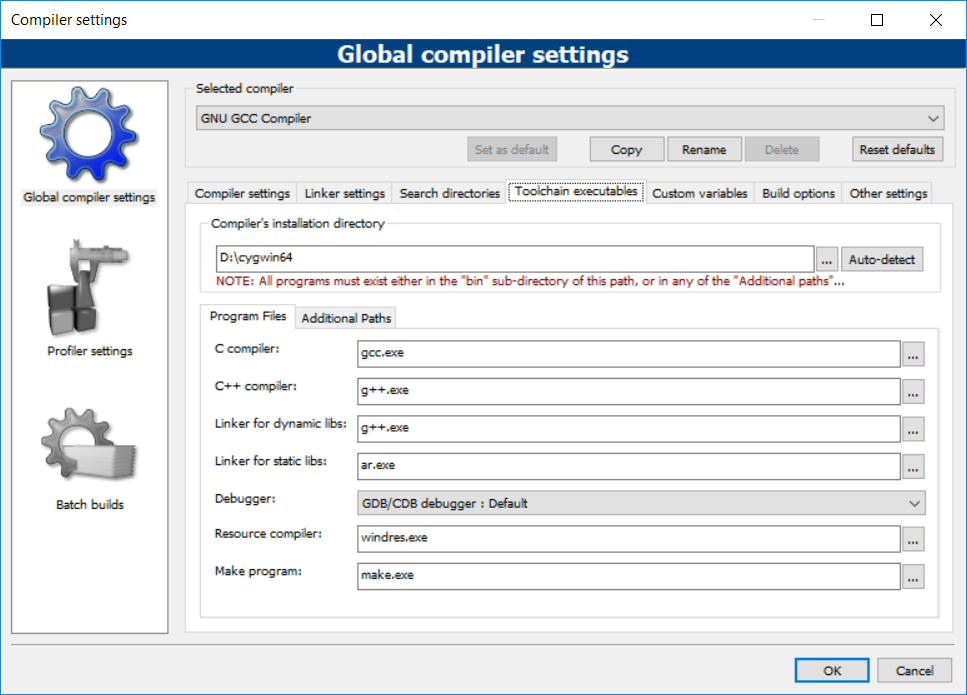

# CodeBlocks Windows deployment

1. Download CodeBlocks for Windows  
http://www.codeblocks.org/downloads

1. Download Cygwin/MinGW as a toolchain for C/C++. CodeBlocks works out of the box with MinGW, but can be set up with Cygwin toolchain as well.  
Cygwin - https://cygwin.com/setup-x86_64.exe  
MinGW - https://sourceforge.net/projects/mingw-w64/

1. Install chosen toolchain (Cygwin/MinGW).
1. Install CodeBlocks.
1. Open CodeBlocks.
1. Go to Settings -> Compiler -> Toolchain executables.
1. If you installed MinGW, just check that every field is filled. In the "Compiler's installation directory" enter the director
1. If you installed Cygwin, change the "Compiler's installation directory" and other fields according to the Cygwin installation directory and utilities.

1. Create an sample project to test the C++ functionality. Go to "File -> New -> Project". Click on "Console application" and confirm it with the "Go" button.
1. A new windows will be opened afterwards. Click "Next", then select "C++" from the list. Click on "Next".
1. Enter project title and select the directory, in which the project will be saved. Click on "Next".
1. On the last screen leave everything as is and click on "Finish".
1. The project will automatically open. To test, if the C++ toolchain is set up correctly, run the project by clicking on the green arrow button or by pressing "Ctrl + F10" on the keyboard.
1. If the project runs and prints "Hello , World!" to the console, everything is working correctly.
1. To test whether the C project can be compiled, click on "C" in the list of languages instead of "C++".