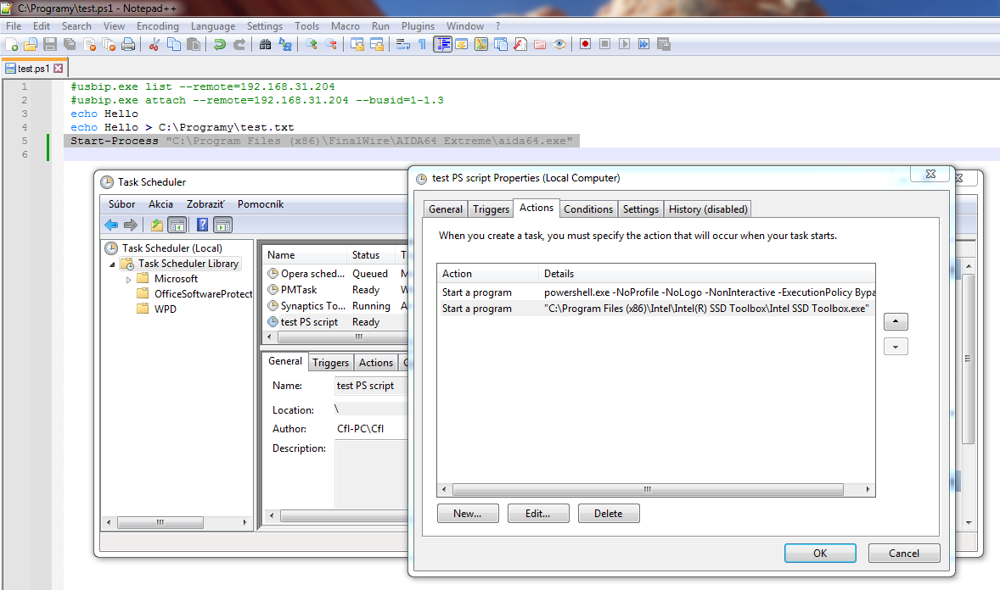
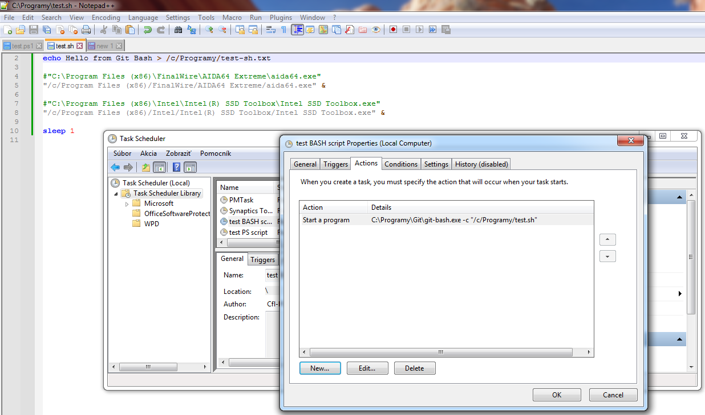

1. Create a scheduled task

    Go to task library in `Task Scheduler`: right click on Windows start menu -> Computer Management -> In the left pane click on Task Scheduler -> Task Scheduler Library

1. In the left pane, click on directory `Task Scheduler Library`.
1. Click on `Create Task` on the right pane.
    - tab `General`
        - name `start Open Hardware Monitor - without UAC prompt`
        - check **Run with highest priviledges** - checking this option will bypass/skip the UAC prompt and executes the commands in `Action` tab as Administrator directly
    - tab `Actions`

        Enter each `Action` via the `New...` button.

        _Program:_ `cmd.exe`  
        _Arguments:_ `/c start "" taskkill /IM OpenHardwareMonitor.exe /F`

        _Program:_ `cmd.exe`  
        _Arguments:_ `/c start "" timeout 1`

        _Program:_ `cmd.exe`  
        _Arguments:_ `/c start "" C:\Programme\openhardwaremonitor-v0.9.6\OpenHardwareMonitor\OpenHardwareMonitor.exe`

        - Notes:
            - **An example to run a PowerShell script as an `Action` from within the scheduled task:**

                - _Program:_ `powershell.exe`  
                - _Arguments:_ `-NoProfile -NoLogo -NonInteractive -ExecutionPolicy Bypass -File C:\Programy\test.ps1`

                A test script that runs apps from a PowerShell script that need Administrator priviledges, thus invoking UAC prompt, is available [here](scripts/test.ps1)

                To start another task/app/command, click on `New...` button on the `Actions` tab  
                **or**  
                use command `Start-Process` within the PowerShell script.

                

                - https://duckduckgo.com/?q=task+scheduler+powershell+script+execution+policy+bypass&ia=web
                - https://stackoverflow.com/questions/13015245/powershell-script-wont-execute-as-a-windows-scheduled-task

            - **An example to run a Bash script as an `Action` from within the scheduled task:**

                Example given for `Git Bash` - install `git` package from https://git-scm.com/ which includes `Git Bash`. Assuming that the `cmd` directory in the installation path, e.g. `C:\Programy\git\cmd` is present in the `Path` environment variable.

                - _Program:_ `bash.exe`  
                - _Arguments:_ `-c "C:\Programy\test.sh"`

                A test script that runs apps from a Shell script that need Administrator priviledges, thus invoking UAC prompt, is available [here](scripts/test.sh)

                To start another task/app/command, click on `New...` button on the `Actions` tab  
                **or**  
                enter the path to the program in quotes as a background task, i.e. with an ampersand `&` at the end of the path, in the Shell script.

                
    
    - tab `Conditions` - uncheck all

1. Create a shortcut, e.g. on the `Desktop` with this `Target`

        schtasks /run /tn "start Open Hardware Monitor - without UAC prompt"

    - https://duckduckgo.com/?q=create+task+scheduler+shortcut&ia=web
    - https://www.addictivetips.com/windows-tips/create-desktop-shortcut-for-scheduled-tasks-windows-10/

---

Sources
- https://duckduckgo.com/?q=run+as+administrator+without+uac+prompt&ia=web
- https://answers.microsoft.com/en-us/windows/forum/all/how-do-i-always-run-a-program-as-an-administrator/f5bd3020-7135-4f03-8820-521b4b35a3b8
- **MAIN GUIDE: https://winaero.com/create-elevated-shortcut-to-skip-uac-prompt-in-windows-10/**
- https://duckduckgo.com/?q=killall+equivalent+command+prompt+windows&ia=web
- https://www.blackmoreops.com/2018/11/09/kill-all-matching-processes-on-windows-from-command-prompt/
- https://duckduckgo.com/?q=start+multiple+commands+cmd+-c&ia=web
- https://stackoverflow.com/questions/48199915/passing-multiple-commands-to-start-command-in-batch-file
- https://linuxhint.com/sleep-five-seconds-cmd/
